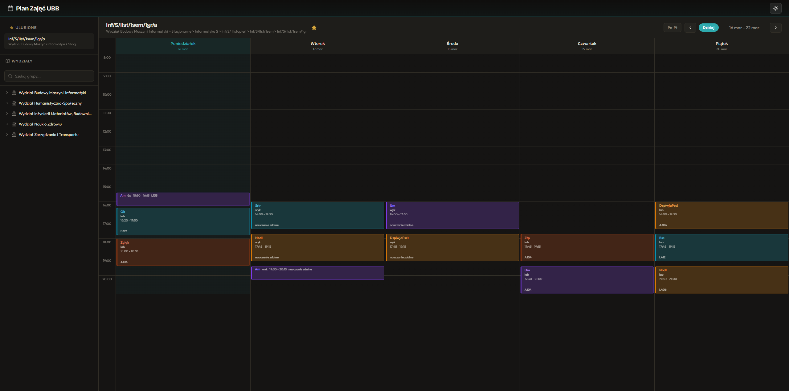

# Plan Zajęć UBB

Alternatywny widok planu zajęć Uniwersytetu Bielsko-Bialskiego, jako zamiennik dla [plany.ubb.edu.pl](https://plany.ubb.edu.pl/).

**Live: [ubbplan.vercel.app](https://ubbplan.vercel.app/)**



## Funkcje

- Przeglądanie planów zajęć po wydziałach, kierunkach i grupach
- Widok tygodniowy z nawigacją między tygodniami
- Ulubione grupy dla szybkiego dostępu
- Tryb ciemny / jasny

## Tech stack

- React 19 + TypeScript
- Vite
- Dane pobierane z API plany.ubb.edu.pl

## Uruchomienie

```bash
npm install
npm run dev
```

## Build

```bash
npm run build
```
